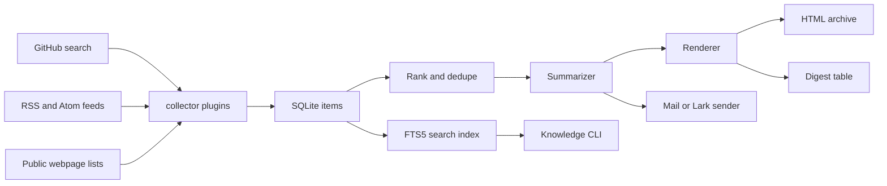

# daily-open-source-brief

Plugin-based daily brief generator for GitHub projects, RSS feeds, public webpages, and a local searchable knowledge base.

Keywords: open-source brief, GitHub trending digest, RSS digest, webpage collector, SQLite FTS5, knowledge base, plugin pipeline, Lark sender, email digest, Python automation, daily report.

中文文档: [README.zh-CN.md](README.zh-CN.md)

`daily-open-source-brief` turns noisy public sources into a searchable daily digest:

- collector plugins fetch GitHub repositories, RSS/Atom feeds, and public webpage lists;
- scoring keeps recent, active, and topic-relevant items near the top;
- summarizer plugins can use an OpenAI-compatible endpoint or deterministic fallback text;
- renderer plugins save digest records and HTML archive output;
- sender plugins can deliver through SMTP or Lark when configured locally;
- SQLite stores items, source health, plugin runs, feedback, tags, and digest history;
- FTS5 search makes collected items reusable from CLI now and a future web console later;
- feedback marks support favorite, read, later, blocked, and not-interested states;
- Windows users get a one-command installer, test script, and optional scheduled task registration.

This repository contains source code, templates, tests, and generic example configuration only. It does not contain runtime databases, local profiles, API keys, private user IDs, private chat IDs, server addresses, generated archives, or local `.env` files.

## Why This Exists

Useful open-source and engineering updates arrive through different channels:

- GitHub search catches active repositories but misses articles and notices;
- RSS feeds are structured but vary in quality;
- public webpage lists are common for organizations that do not publish feeds;
- email or chat delivery is useful, but the collected content should remain searchable after the daily message is sent.

This project keeps those jobs separate through a plugin pipeline:

| Stage | Job |
|---|---|
| `provider` | Configure LLM/provider runtime |
| `collector` | Fetch GitHub, RSS, and webpage candidates |
| `enricher` | Apply feedback weights, dedupe, deadlines, and Lark digest filtering |
| `summarizer` | Generate digest text |
| `renderer` | Save digest records and HTML archive |
| `sender` | Deliver through configured channels |

## Architecture



## Features

- Plugin registry and config-driven pipeline in `config/plugins.yml`.
- Built-in collectors for GitHub repositories, optional GitHub Trending, RSS/Atom entries, and public webpage list pages.
- Enricher plugins for feedback weights, deadline extraction, cross-source dedupe, and important-item Lark digests.
- Local plugin loading from `plugins/local/*.py`.
- SQLite persistence for sources, items, repo snapshots, digests, source runs, plugin health, tags, feedback, and deadline events.
- SQLite FTS5 search index for item title, snippet, URL, and source type.
- Knowledge API in `app/knowledge.py` for CLI and future web-console reuse.
- Knowledge CLI for search, recent items, saved items, marks, and tags.
- Weekly metrics and lightweight Lark bot helpers backed by SQLite state.
- Existing `app.brief_cli` entry kept for compatibility.
- Deterministic fallback summaries when LLM configuration is absent.
- Optional OpenAI-compatible LLM configuration.
- Optional SMTP and Lark delivery.
- Optional Webhook delivery.
- HTML archive generation with retention cleanup.
- HTML email rendering through Jinja templates.
- Windows onboarding scripts and GitHub Actions CI.
- Unit tests for collectors, rendering, plugin management, FTS, knowledge operations, and CLI behavior.

## Requirements

- Python 3.10+
- SQLite with FTS5 support
- Network access for live GitHub/RSS/webpage collection
- Optional: GitHub token for higher GitHub API limits
- Optional: SMTP credentials or `lark-cli` identity for delivery

Install dependencies:

```powershell
python -m venv .venv
.\.venv\Scripts\python.exe -m pip install -r requirements.txt
```

Linux/macOS:

```bash
python3 -m venv .venv
. .venv/bin/activate
python -m pip install -r requirements.txt
```

## Quick Start

Windows one-command setup:

```powershell
Set-ExecutionPolicy -Scope Process -ExecutionPolicy Bypass
powershell.exe -NoProfile -ExecutionPolicy Bypass -File .\scripts\install-windows.ps1
```

Run an offline sample without sending messages:

```powershell
python -m app.cli run --sample --skip-web --skip-rss --skip-mail --skip-lark --force-send
```

Search the local knowledge base:

```powershell
python -m app.cli kb search Python
python -m app.cli kb recent
python -m app.cli kb mark 1 favorite
python -m app.cli kb mark 1 read
python -m app.cli kb tag 1 open-source
python -m app.cli kb saved
```

Manage plugins:

```powershell
python -m app.cli plugin list
python -m app.cli plugin check
python -m app.cli plugin disable rss
python -m app.cli plugin enable rss
python -m app.cli plugin status
```

Windows workflow docs:

- [Windows install guide](docs/install-windows.md)
- [Chinese workflow guide](docs/workflow-zh.md)

## Configuration

Copy `.env.example` to `.env` locally and fill only the providers you need. `.env` is ignored by git.

Required for live GitHub collection:

```text
GITHUB_TOKEN=
```

Optional mail delivery:

```text
SMTP_HOST=
SMTP_PORT=587
SMTP_USER=
SMTP_PASS=
MAIL_TO=
MAIL_FROM=
```

Optional OpenAI-compatible summarization:

```text
OPENAI_API_KEY=
OPENAI_BASE_URL=https://api.openai.com/v1
OPENAI_MODEL=
```

Public source fetches ignore system proxy settings by default. If a host must use `HTTP_PROXY`/`HTTPS_PROXY`, opt in explicitly:

```text
DAILY_BRIEF_TRUST_ENV_PROXY=1
```

Optional Lark delivery:

```text
LARK_SEND=1
LARK_AS=bot
LARK_USER_ID=ou_xxx
```

Public sources live in `config/sources.yml`. The included webpage source is a disabled example; replace it with public pages you are allowed to fetch.

## Plugin Development

New collectors, summarizers, renderers, senders, providers, and scoring strategies should be plugins.

- Built-in plugins live in `app/plugins/builtins.py`.
- Local plugins live in `plugins/local/*.py`.
- Local plugins expose `register(registry)`.
- Plugin switches and options live in `config/plugins.yml`.
- Shared runtime data goes through `PluginContext.state`.
- New plugins should include focused tests.

## Knowledge Base

The knowledge layer is intentionally SQL-backed and small:

- `items_fts` mirrors item title, snippet, URL, and source type.
- `item_tags` stores reusable labels.
- `item_feedback` stores favorite/read/later/blocked/not-interested marks.
- `app/knowledge.py` is the public API for CLI and future web UI.

Current commands:

```bash
python -m app.cli kb search EDA
python -m app.cli kb recent
python -m app.cli kb mark 123 favorite
python -m app.cli kb mark 123 read
python -m app.cli kb tag 123 open-eda
python -m app.cli kb saved
```

## Verify

```powershell
python -m pytest
python -m unittest discover -s tests -v
git diff --check
```

Windows all-in-one check:

```powershell
powershell.exe -NoProfile -ExecutionPolicy Bypass -File .\scripts\test.ps1
```

Expected:

- collector parser tests pass;
- plugin registry and plugin health tests pass;
- FTS search tests pass;
- knowledge mark/tag/saved tests pass;
- deadline, dedupe, feedback, retry, weekly metrics, and sender tests pass;
- CLI tests pass.

## Security

- Do not commit `.env`, `config/profile.yml`, SQLite databases, generated archives, logs, or local deployment packages.
- Use `.env.example` for public examples.
- Keep deployment hosts, private user IDs, private chat IDs, and API tokens out of the repository.
- Treat `plugins/local/` as local extension space; review local plugins before publishing.

## License

MIT. See [LICENSE](LICENSE).
